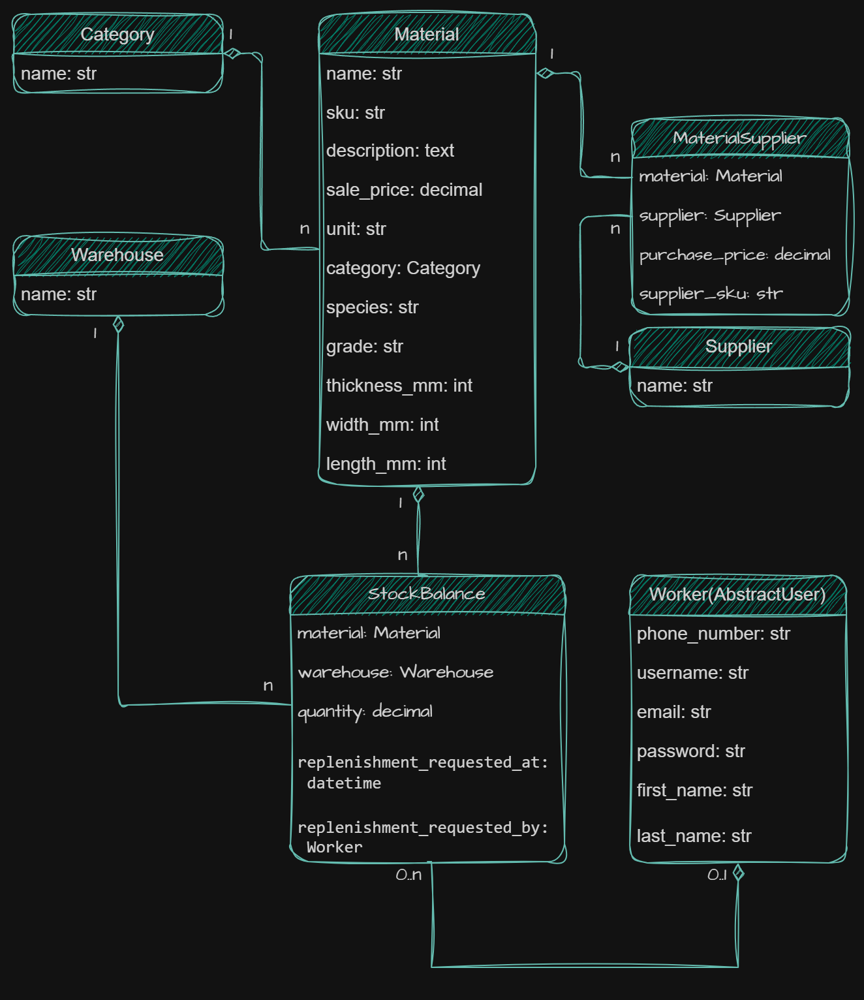

# Lumberyard

**English** | [Українська](README.uk.md)

Lumberyard is my first Django learning project. It is a small web application
for a timber business with two parts:

- a public website with a read-only material catalog;
- an internal workspace for workers to manage inventory information.

The project was created as part of my Python and Django studies.

## Features

### Public pages

- Home page
- Material catalog
- Search by material name or SKU
- Filter by category
- Material details and availability status
- Delivery and contact information

The public catalog shows only a general `Available` or `Contact us` status.
It does not show exact material quantities, internal warehouse names,
suppliers, their SKUs, or purchase prices.

### Internal workspace

Authenticated workers can:

- view a dashboard with current project data;
- create, update, search, and delete materials;
- manage categories, warehouses, and suppliers;
- update material quantities for each warehouse;
- manage supplier offers and purchase prices;
- create and clear manual replenishment requests;
- view worker accounts;
- create and delete worker accounts with the required permissions;
- current and superuser accounts are protected from deletion through the
  internal interface.

## Technologies

- Python
- Django 6
- SQLite
- Bootstrap 5
- django-crispy-forms
- django-phonenumber-field

## Data model

The project uses seven main models:

- `Worker` — a custom Django user for employees;
- `Category` — a group of materials;
- `Material` — catalog and product information;
- `Warehouse` — a stock location;
- `StockBalance` — the quantity of a material in one warehouse;
- `Supplier` — supplier information;
- `MaterialSupplier` — a supplier offer for a material.

## Database diagram

The diagram reflects the current seven-model structure. The editable draw.io
source is available in
[`docs/lumberyard-db-structure.drawio`](docs/lumberyard-db-structure.drawio).



## Local setup

Python 3.12 or newer is required.

1. Clone the repository and open the project directory:

   ```bash
   git clone https://github.com/2d1Corp/lumberyard.git
   cd lumberyard
   ```

2. Create a virtual environment:

   ```bash
   python -m venv venv
   ```

3. Activate it.

   In Windows PowerShell:

   ```powershell
   .\venv\Scripts\Activate.ps1
   ```

   On macOS or Linux:

   ```bash
   source venv/bin/activate
   ```

4. Install the dependencies:

   ```bash
   python -m pip install -r requirements.txt
   ```

5. Create a local environment file.

   In Windows PowerShell:

   ```powershell
   Copy-Item .env.example .env
   ```

   On macOS or Linux:

   ```bash
   cp .env.example .env
   ```

   The example values are suitable for local development. Outside the local
   environment, use a separate secret key, set `DJANGO_DEBUG=False`, and
   configure `DJANGO_ALLOWED_HOSTS` for the deployed host.

6. Apply the database migrations:

   ```bash
   python manage.py migrate
   ```

7. Load the demo catalog and inventory data:

   ```bash
   python manage.py seed_data
   ```

8. Create a user for the internal workspace:

   ```bash
   python manage.py createsuperuser
   ```

9. Start the development server:

   ```bash
   python manage.py runserver
   ```

Open `http://127.0.0.1:8000/` in a browser. The internal workspace is available
after signing in at `http://127.0.0.1:8000/login/`.

## Demo data

The `seed_data` command is safe to run more than once. It creates a small demo
dataset with:

- 2 material categories;
- 8 timber and sheet materials;
- 2 warehouses;
- 2 suppliers;
- stock balances and supplier offers.

The command does not create a worker account.

## Main workflows

### Public visitor

1. Open the home page.
2. Browse or search the catalog.
3. Open a material page.
4. Check its general availability and use the delivery or contact information.

### Worker

1. Sign in and open the dashboard.
2. Find or create a material.
3. Update its warehouse stock and supplier offers.
4. Create a replenishment request for a specific warehouse when needed.

## Project scope

This is a learning project, not a production inventory system. It demonstrates
basic Django models, forms, views, authentication, permissions, templates, and
tests.

Lumberyard is not an online shop, accounting system, CRM, or full warehouse
management system. It does not include customer accounts, orders, payments, or
automatic purchasing.
